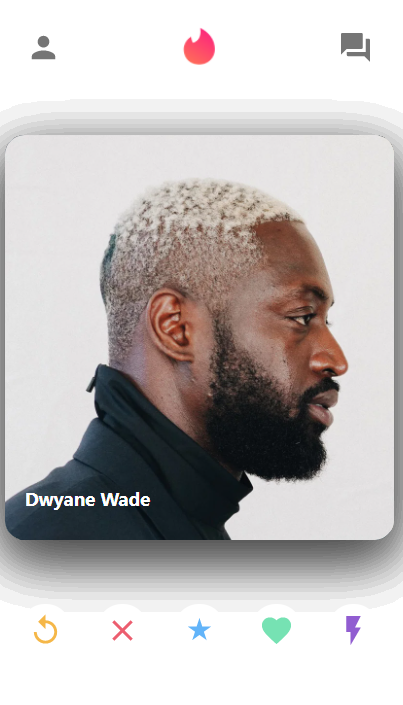

# Tinder Clone MERN STACK

<<<<<<< HEAD

=======
    
>>>>>>> c844aad907efa20a4fa4e914cb9c7e8543236d50

## Reference Links

Link to Tinder-Clone App - [Tinder-Clone App](https://socialmediacloneware.github.io/tinder-clone/)

Link to Project Board used for application development - [Project Board](https://github.com/SocialMediaCloneware/tinder-clone/projects/1)

Link to Presentation - [Presentation](https://docs.google.com/presentation/d/1-oT5BpBj-Zsngm8d2Li-OVRJtekQ4Wk88fdCKYQyjs0/edit?usp=sharing)

### Table of Contents

- [Application MVP](#application-mvp)
- [Flow Charts](#flow-chart)
- [Project Description](#project-description)
- [Technology Used](#technology-used)
- [Core Node Dependencies](#core-node-depencencies)
- [Future Development](#future-development)

---

## Application MVP

- Tinder app  with swipe-able cards with working database.
- Tinder Chat Component with multiple users’ messages displayed.
- Chat Screen with reply capability.

---

## Flow Chart

---

## Project Description

Tinder-Clone is a beginner friendly clone version of an online dating app, Tinder. It is a MERN Stack app meaning, it contains frontend and backend development. This is an app to be developed as an educational purpose only.

---

## Technology Used

- Create-React-App
- MongoDB
- Mongoose
- Express
- React.js 
- Node.js  
- Heroku
- Material-ui
- Javascript
- HTML
- CSS
- GitHub
- Postman

---

## Core Node Dependencies

- Create-React-App using `npx create-react-app my-app`
- @material-ui/core using `npm i @material-ui/core using`
- @material-ui/icon using `npm i`
- axios using `npm i axios`
- react-router-dom using `npm i react-router-dom`
- react-tinder-card using `npm i react-tinder-card`
- Express using `npm i Express`
- Mongoose using `npm i Mongoose`

---

## Future Development

The app will be further developed to become a fully functional app and will be used for future developmet of "Dinder" which is short for Developers Tinder. This is yet to be determined when it will be developed.
